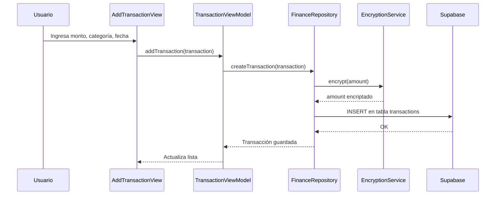
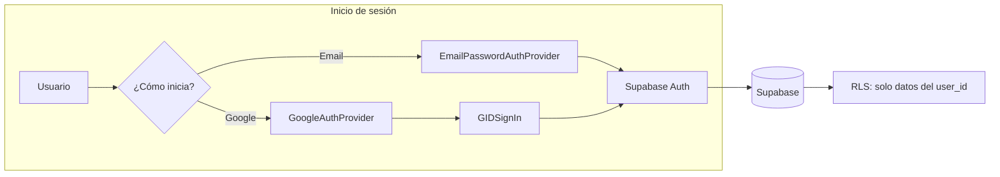
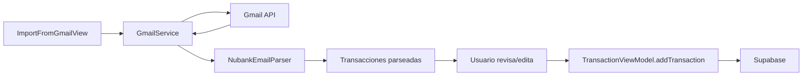

# FinanceFlow

App de finanzas personales para iOS. Registra ingresos y gastos, organízalos por categorías y tarjetas, y visualiza tu situación financiera en un dashboard.

## ¿Qué hace la app?

- **Transacciones**: Registra ingresos y gastos con categoría, fecha y notas
- **Tarjetas**: Gestiona tarjetas de crédito y débito (límites, fechas de corte)
- **Dashboard**: Balance total, resumen ingresos vs gastos, gráficos de actividad
- **Importar desde Gmail**: Conecta tu Gmail y extrae gastos automáticamente de correos de Nubank
- **Exportar**: Genera CSV de tus transacciones para análisis externo

Los montos se encriptan antes de guardarse. Cada usuario solo ve sus propios datos.

---

## Requisitos

- iOS 17+
- Xcode 15+
- Cuenta en [Supabase](https://supabase.com)
- (Opcional) Cuenta Google para importar desde Gmail

---

## Instalación rápida

1. **Clonar** el repositorio
2. **Crear proyecto** en [Supabase](https://supabase.com) y ejecutar las migraciones en `supabase/migrations/` (en orden)
3. **Configurar credenciales**:
   - Copiar `financeApp/Secrets.example.plist` → `Secrets.plist`
   - Rellenar `SUPABASE_URL` y `SUPABASE_ANON_KEY` (Settings → API en Supabase)
4. **Abrir** `financeApp.xcodeproj` en Xcode y ejecutar (⌘R)

Para **Google Sign-In** e **importar desde Gmail**, ver la sección [Configuración avanzada](#configuración-avanzada) más abajo.

---

## Cómo se conectan los componentes

### Vista general

```mermaid
flowchart TB
    subgraph App["📱 App iOS"]
        Entry[financeApp]
        Root[RootView]
        Login[LoginView]
        Content[ContentView]
        Entry --> Root
        Root -->|No autenticado| Login
        Root -->|Autenticado| Content
    end

    subgraph ContentTabs["Pestañas principales"]
        Dashboard[Dashboard]
        Transacciones[Transacciones]
        Content --> ContentTabs
    end

    subgraph Servicios["Servicios"]
        Auth[AuthService]
        Repo[FinanceRepository]
        Gmail[GmailService]
        Encrypt[TransactionEncryption]
    end

    subgraph Backend["☁️ Backend"]
        Supabase[(Supabase)]
        GmailAPI[Gmail API]
    end

    Login --> Auth
    Content --> Repo
    Transacciones --> Gmail
    Repo --> Supabase
    Repo --> Encrypt
    Gmail --> GmailAPI
    Auth --> Supabase
```

### Flujo de datos: de la pantalla al servidor

Cuando agregas una transacción, el flujo es:



### Autenticación

La app soporta **email/contraseña** y **Google**. El flujo de login:



### Importación desde Gmail



---

## Estructura del proyecto

```
financeApp/
├── financeApp/
│   ├── Models/          # Transaction, Card, Category, Bank
│   ├── Repositories/    # FinanceRepository (acceso a datos)
│   ├── Services/        # Auth, Gmail, encriptación, exportación
│   ├── ViewModels/      # Lógica de negocio para la UI
│   ├── Views/           # Pantallas SwiftUI
│   └── Utilities/       # Formateo, parseo de clipboard
├── supabase/migrations/ # Esquema de base de datos
├── scripts/             # Scripts de prueba (Gmail API)
└── financeApp.xcodeproj
```

| Capa | Responsabilidad |
|------|-----------------|
| **Views** | Pantallas e interacción con el usuario |
| **ViewModels** | Estado de la UI y coordinación con repositorios |
| **Repositories** | Lectura/escritura en Supabase |
| **Services** | Auth, Gmail, encriptación, exportación |

Para más detalle sobre capas, navegación y flujos, ver [docs/ARQUITECTURA.md](docs/ARQUITECTURA.md).

---

## Configuración avanzada

### Google Sign-In e importación desde Gmail

1. En [Google Cloud Console](https://console.cloud.google.com/) crea dos Client IDs:
   - **iOS** (para la app)
   - **Web** (para Supabase)

2. En `Secrets.plist` añade:
   - `GCP_PROJECT_ID_API`: Client ID iOS
   - `GOOGLE_WEB_CLIENT_ID`: Client ID Web
   - `GOOGLE_CLIENT_SECRET`: Client Secret del cliente Web

3. En **Supabase** → Authentication → Providers → Google: configura Client ID y Client Secret del cliente Web

4. En **Xcode** → Target → Info → URL Types: añade `com.googleusercontent.apps.TU_CLIENT_ID_IOS` (invierte el Client ID iOS)

### Scripts de prueba (Gmail)

En `scripts/` hay scripts para probar la Gmail API sin ejecutar la app:

- `fetch_gmail_nu.py`: Obtiene correos de Nubank desde Gmail
- `gmail_nu_sample_sanitized.json`: Ejemplo de formato de respuesta (sin datos reales)

Uso: `GMAIL_ACCESS_TOKEN="tu_token" python3 scripts/fetch_gmail_nu.py`

---

## Dependencias

- [Supabase Swift](https://github.com/supabase/supabase-swift)
- [Google Sign-In iOS](https://github.com/google/GoogleSignIn-iOS)

---

## Licencia

Ver [LICENSE](LICENSE).
