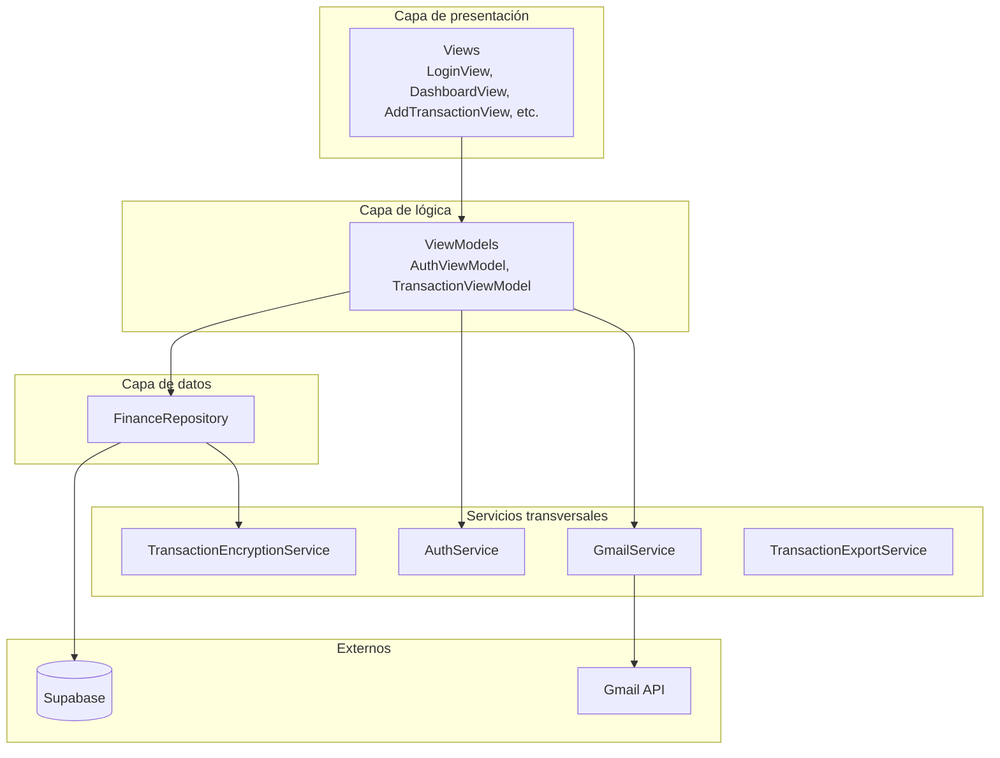
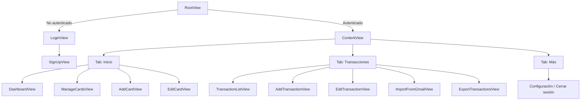
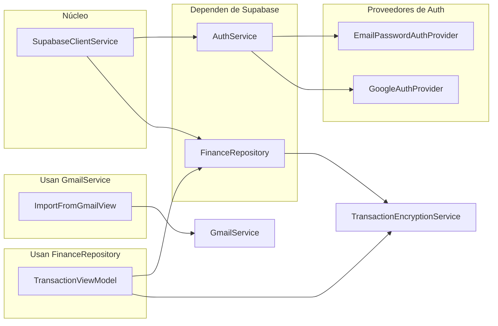
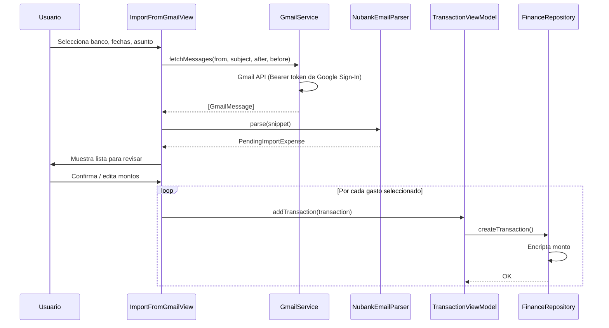
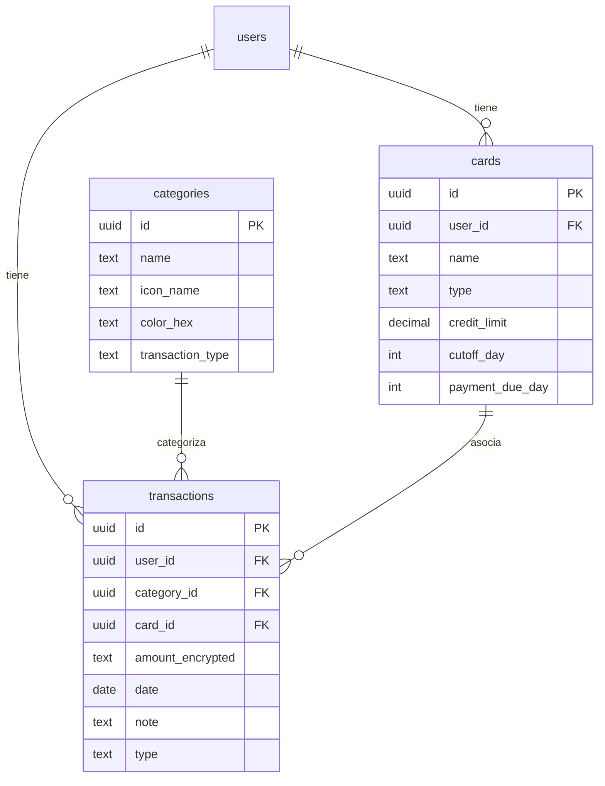

# Arquitectura de FinanceFlow

Documento de referencia para entender cómo se conectan los componentes de la aplicación.

---

## Diagrama de capas

---

## Navegación y flujo de pantallas

---

## Dependencias entre servicios

---

## Flujo de importación desde Gmail (detalle)

---

## Modelo de datos (tablas principales)

